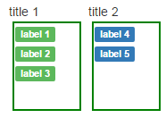

# shinyExtra
In a similar manner to the [shinyBS](https://github.com/ebailey78/shinyBS) package by [@ebailey78](https://github.com/ebailey78), here are some additional functions that I often use in shiny apps.

## Install

```r
library(devtools)
devtools::install_github("harveyl888/shinyExtra")
```

## Usage
#### SXPanel
``` r
SXPanel(inputId, ..., heading = '', text_size = NULL, styleclass = 'default', checkbox = FALSE, collapsible = FALSE, removeButton = FALSE, icon = NULL)
```
Add a bootstrap panel to a shiny app.  The panel can be collapsible, display an glyphicon icon and include a button to deletet the panel (all displayed on the right of the panel header).  It may also have a checkbox, displayed to the left of the panel header, which is exposed as inputId_check.
#### SXlabel
``` r
SXLabel(inputId, label=NULL, styleclass = 'default', link = NULL)
```
Add a label with an optional hyperlink.
#### SXTextArea
``` r
SXTextArea(inputId, label = NULL, text = NULL, placeholder = NULL, resizable = TRUE, rows = 5, cols = 40)
```
Add a multiline input, default size = 5 rows, 40px wide.  If cols = '100%' then the input will expand to its parent's width.
#### SXSortable
``` r
SXSortable(inputId, labels = NULL, styleclass = NULL, headers = NULL, colorByGroup = TRUE, width = NULL, height = '120px')
```
Add multiple sortable lists of labels based using jquery-ui sortable.  Labels can be moved between lists and the contents of each list can be returned as shiny variables (`inputId_val_n`) where *n* is the list number.
Data are input as a list of lists, along with lists of styleclasses and headers.  If colorByGroup is set to true then colors will be linked to columns and labels will change to the color associated with a column when moved, otherwise labels will keep their initial color upon moving.  
for example:
```r
SXSortable('sort1', labels = list(list("label 1", "label 2", "label 3"), list("label 4", "label 5")), styleclass = list("success", "primary"), headers=list("title 1", "title 2"), height = 100)
```
would generate the following output:  
  
and the shiny variables `input$sort1_val_1` and `input$sort1_val_2` would contain the values of the two boxes.  
This function is still being worked on and is still somewhat *experimental*.

